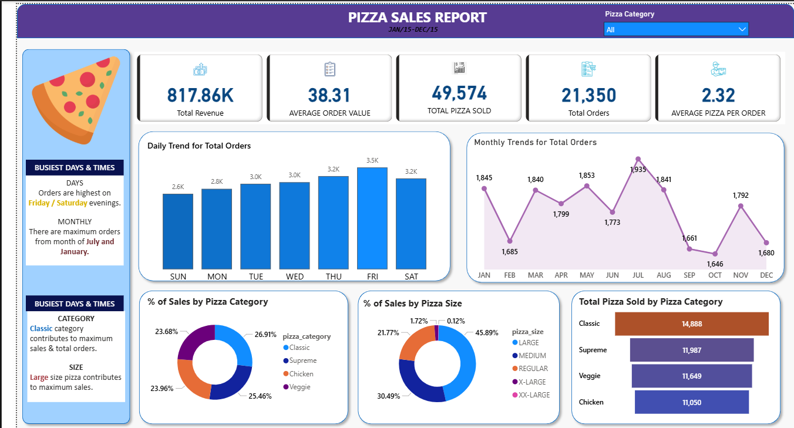

# 🍕 Pizza Sales Analysis Dashboard (Power BI)

An interactive Power BI dashboard built to analyze pizza sales performance, customer ordering patterns, and business trends for data-driven decision making.

---

## 📌 Business Problem
A pizza restaurant wants to understand:
- When sales are highest
- Which pizza categories and sizes perform best
- How customer ordering behavior changes over time

This dashboard helps stakeholders optimize **inventory, staffing, and promotions**.

---

## 🎯 Objectives
- Monitor overall sales performance
- Identify peak sales periods
- Analyze sales distribution by pizza category and size
- Enable interactive data exploration

---

## 📊 Key KPIs
- Total Revenue  
- Total Orders  
- Total Pizza Sold  
- Average Order Value  
- Average Pizza per Order  

---

## 📈 Dashboard Overview

---

## 🔍 Key Insights
- Sales peak on **Friday and Saturday evenings**
- **Classic category** contributes the highest sales
- **Large size pizzas** generate the maximum revenue
- Highest order volumes occur in **July and January**

---

## 🧰 Tools & Technologies
- Power BI  
- DAX (Calculated Measures)  
- Data Modeling  
- Interactive Visualizations  

---
